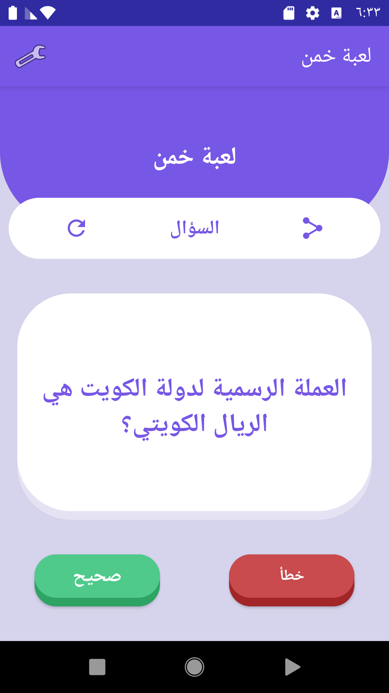
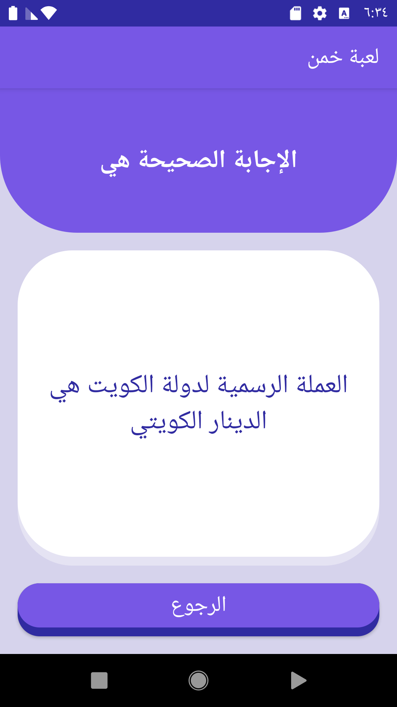

# Guess The Correct Answer Android App

This is the repository for "guess the correct answer" app that students build during [the Android Degree at Barmej.com](https://www.barmej.com/degree/android)

This app is a simple Android app that asks users random questions from a predefined list of questions. The user will be able to answer the question by pressing the true button or the false button.
The app will give feedback for the user if his answer or correct or not, If it's not correct the app will also show him the correct answer.
The user will also be able to share a question with his friends.
Additionally, The app include settings menu which allows the user to change the app language manually at runtime.

To use this repository, fork/clone it, or download a zip using the green "Clone or download" button at the top of the file list. Each branch correspond a video lesson in the course.

# Screenshots
 

# Contributing
All contributions are welcome and gratefully accepted.

# License

A copy of the license is also available in the [license file](LICENSE).

# Demo

